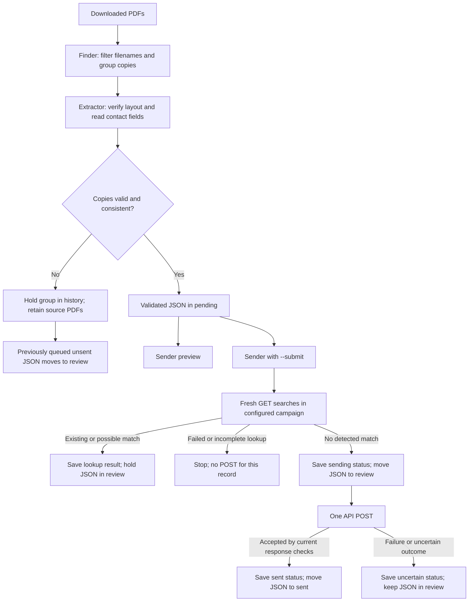

# Code walkthrough and rollout review

Reviewed September 18, 2026, including the existing-person GET lookup. This guide explains every runtime module, the queue and API boundaries, the tested behavior, and the remaining rollout work. It is intended for a detailed code-reading session; it is not a statement that the program is ready for unattended use.

The original review investigated cases using invented data and mocked requests. A later implementation added `action_builder_lookup.py` and integrated its checks with sending and queue history. This refresh describes that current implementation, with current function locations and source fingerprints. The full 153-test suite passed again during this refresh. No requests to your organization’s API were used for this review; public documentation and local mocked tests are not a live integration test.

For a first reading, use sections 1–3 for the workflow and release blockers, sections 6–10A while reading the Python files, and sections 13–19 for validation and acceptance decisions. The commands in this guide are examples for the operator; API commands are explicitly identified and were not run against your organization as part of the review.

**Reading map:** start with the [workflow](#1-what-the-program-actually-does), [current assessment](#2-current-assessment), and [confirmed findings](#3-confirmed-findings-and-rollout-gaps). Then follow the [file responsibilities](#4-files-and-responsibilities) into the module walkthroughs. For the weekend review, use the [acceptance worksheet](#19-acceptance-matrix-and-decisions-before-deployment). The [commit instructions](#20-git-commit-information-for-the-current-changes) and [private-use licensing discussion](#21-private-use-license-ownership-and-practical-limits) are at the end.

## 1. What the program actually does

Your understanding is close. The distinction is **when the persistent queue is created**:

1. You download completed paperwork into Downloads.
2. You run `extract_person.py`.
3. The finder lists matching files in the top level of Downloads and groups related filenames in memory.
4. The extractor reads each relevant PDF, validates the checklist layout and contact fields, and compares copies.
5. A successful extraction creates a contact JSON record in `composed_info/pending` and records its history.
6. You run `send_person.py` to preview the currently pending records.
7. You run `send_person.py --submit` to submit those records.
8. **New: before each creation attempt, `action_builder_lookup.py` makes GET searches for that pending person in the configured campaign.** It saves the result locally. Existing people or possible matches move to `review`; a failed/incomplete lookup stops the batch without attempting to create that person.
9. Only a record with a fresh `not_found` result reaches the send claim and POST. The sender records the attempt before making that POST. A successful-looking response currently moves the record to `sent`; an uncertain attempt goes to `review`.

You can run `python action_builder_lookup.py` separately between preview and submission to address matches first. That command performs GET checks only and updates the local queue. Submission still checks again; an earlier clear result is not lasting permission to create someone.

There is **no separate persistent queue of PDFs waiting for extraction**. The PDFs stay in Downloads. The persistent queue stores the extracted contact information. The initial file groups exist only while extraction runs.



The arrow through preview is optional in the actual code. There is no saved “a human approved this record” flag. A user can run `--submit` without previewing first. Functions named `extract_approved_person` and `load_approved_person` use “approved” to mean accepted by program rules, not signed off by a person.

The finder does not watch Downloads continuously. Extraction and sending are separate commands. The API lookup compares stored contact data against Action Builder; **it does not check Downloads for newer paperwork or establish which PDF is correct**. New or corrected PDFs still require extraction and review before submission. F2–F5 describe local issues that this remote check does not repair.

## 2. Current assessment

The project has a useful separation of responsibilities and meaningful regression tests. It is suitable for studying the workflow and testing extraction and previews with controlled examples.

**I would resolve the confirmed findings below before unattended or multi-computer rollout.** Passing the current tests establishes that the tested cases work; it does not establish complete duplicate prevention, correct handling of every exported PDF, or successful integration with your organization’s live campaign.

The existing-person decision now has a conservative implementation: matches are held, and only a fresh successful no-match check permits a creation attempt through the normal CLI. It needs real campaign validation, an operator reconciliation workflow, and the address-candidate correction in F11. Filename aliases, late corrections, exceptional PDF failures, and POST response validation remain separate issues; destination formatting is now validated as described in F7.

| Area | Implemented now | Evidence or remaining limitation |
|---|---|---|
| Download discovery and template extraction | Yes | Synthetic PDFs and file-race cases tested; representative real exports still need field-by-field comparison |
| Managed pending/sent/review queue | Yes | Integrity, migration, and attempt-history tests pass; alias and recovery findings remain |
| Offline preview | Yes | Tests prohibit HTTP; opening the queue can still perform local recovery/migration |
| Existing-person GET checks | Yes | Mocked client and workflow tests pass; F11 remains open, and campaign coverage/exact filter behavior need live validation |
| Conditional POST | Yes | Tests exercise request orchestration with mocks; F6 shows the current completion check is insufficient |
| Operator resolution of API matches or uncertain POSTs | No | Investigate manually and retain the hold; there is no supported release/reconciliation command |
| Automatic detection of newer PDFs during sending | No | Run extraction separately; a GET search cannot inspect Downloads |
| Desktop double-click application, installer, or bundled Python | No | Current interface is command-line Python; deployment remains separate work |
| Organization-wide or multi-computer duplicate guarantee | No | Campaign searches and a local queue lock cannot supply that guarantee |

## 3. Confirmed findings and rollout gaps

The terms below describe impact in this project:

- **Before rollout:** could send stale or duplicate contact information, misdirect a request, or incorrectly mark work complete.
- **Operational issue:** can block legitimate work or requires a recovery procedure.
- **Design decision:** behavior is intentional or understandable, but you should explicitly accept it.

### F1. Existing-person checking is implemented; scope and review remain limited

**Status:** the originally missing GET stage is implemented. Validate its matching policy and resolve operational limits before rollout.

**Read:** `action_builder_lookup.py`, `send_person.check_queue()`, `send_person.send_queue()`, and `RecordQueue.record_lookup()`.

The original sender posted without a remote search. It now searches the configured campaign by email, phone, and surname, combines candidates by Action Builder ID, and compares the nine contact fields. One Person entity matching every field is `existing`; other possible matches are `needs_review`. Both outcomes hold the local record in `review`; they do not update a remote person, delete anything, or count as a successful creation. A complete search without candidates is `not_found`. A failed search raises an error rather than returning that result.

Every normal submission performs a fresh lookup before the send claim. The standalone lookup CLI saves evidence for operator review but does not grant durable approval. The local `person-<hash>.json` filename remains a content fingerprint, not a remote ID; candidate Action Builder IDs are saved separately in the lookup receipt.

Searches cover the configured campaign, not the entire organization. Exact searches and limited formatting normalization can miss a person whose details have changed sufficiently. Two independent computers can both see no match before either creates a person. One designated sender is the recommended initial operating model; the local queue lock is not a cross-computer identity guarantee.

API-related holds persist across re-imports, PDF `--resolve`, and connected filename aliases. There is not yet a release/reconciliation command. Review the remote record and source information without editing the ledger or moving JSON files to force another send. Section 10A explains the decisions and functions.

### F2. Two filename aliases can eventually send two versions of one previously shared contact

**Type:** confirmed duplicate-prevention gap; before rollout.

**Read:** `RecordQueue._eligible()` at `record_queue.py:437`, `enqueue()` at `record_queue.py:504`, and `begin_send()` at `record_queue.py:594`.

Reproduction using invented records and no HTTP:

1. Queue the same contact data under filename families A and B. They correctly share one record, R1.
2. A receives changed contact data, R2.
3. Explicitly resolve A to R2.
4. Explicitly resolve B to the old R1.
5. Both R1 and R2 can now be pending.
6. Calling the queue’s claim and completion methods for R2 and then R1 succeeds for both.

This matters when A and B are two filenames for the same person’s paperwork. Equality of nine fields is not absolute proof of a person’s identity, but the queue previously treated these two inputs as one shared contact record. Its protection against sending different historical versions is not consistently preserved when the filename groups split.

The underlying issue is that eligibility considers the record’s **current owners**, while the family histories remember earlier shared records differently. The new API-related hold follows historical alias connections once a match is found, but it does not itself repair the original alias/attempt model. A fresh lookup may block the second version if it can still match the remote person; that is not a substitute for an explicit alias policy and regressions in both send orders.

### F3. Shared records can get stuck in review

**Type:** confirmed availability bug; operational issue.

**Read:** `RecordQueue._eligible()` at `record_queue.py:437`, `_revoke()` at `record_queue.py:452`, and `enqueue()` at `record_queue.py:504`.

Reproduction:

1. A and B share the same contact record.
2. Hold A for review.
3. Process an identical record for B under a new source fingerprint.
4. B is also held because the shared record has another held owner.
5. Repeatedly resolving A or B still returns `review`.

Each group sees the other group’s hold and reestablishes its own. There is no working single-group resolution sequence for this reproduced state. This should be addressed in the alias model rather than by telling an operator to edit the history manually.

### F4. The final automatic rescan can see a correction without holding the old pending record

**Type:** confirmed stale-data gap; before rollout.

**Read:** `extract_person.py:492`, particularly the final comparison beginning near line 514.

Reproduction with synthetic PDFs:

1. Morgan’s original PDF has already produced a pending record.
2. That original PDF is no longer in Downloads when the next scan starts.
3. The scan starts processing another person’s PDF.
4. A corrected Morgan PDF arrives during that extraction.
5. The final discovery sees Morgan’s corrected file as ready.
6. The old Morgan record nevertheless remains pending, with no review or deferral reported for it.

The final comparison iterates over the initially ready groups, rather than all relevant groups in the union of the initial and final snapshots. A newly observed ready family with existing queue history can therefore be missed. The explicit single-file path has additional rechecking and is not identical to this automatic path.

### F5. Some PDF exceptions leave an older version pending

**Type:** confirmed stale-data gap; before rollout.

**Read:** `extract_person.py:197`, `extract_person.py:419`, particularly the exception handling near line 466.

A synthetic corrected PDF with `/UserUnit` set to a nonnumeric value raises a plain `ValueError` during layout validation. `_import_group()` handles the project’s `ExtractionError` and pypdf’s `PdfReadError`, but this plain `ValueError` does not pass through the branch that holds the filename family.

If the family already had a pending record, that older record remains pending. The CLI reports failure, but a later independent sender command can still submit the old record.

The extractor needs a consistent boundary around parser failures so a failed correction cannot leave its predecessor eligible by accident. The solution should preserve useful error information without printing personal document contents.

### F6. An unexpected successful JSON object can be marked sent

**Type:** confirmed completion-validation bug; before rollout.

**Read:** `submit_to_actionbuilder()` at `send_person.py:246`, `send_queue()` at `send_person.py:361`, and `RecordQueue.finish_send()` at `record_queue.py:618`.

The sender requires successful JSON decoding and a top-level dictionary. It does not require a returned person object or a usable person identifier before calling `finish_send()`.

Mocked HTTP 200 responses containing each of these produced a `sent` record, an empty receipt, and exit code 0:

```json
{}
```

```json
{"error": "not a returned person"}
```

```json
{"person": null}
```

These are controlled test responses, not observed responses from your organization. They demonstrate that the current success check is too weak. Unexpected responses after a POST should remain uncertain until reconciled; they should not trigger an automatic retry, because a server-side write might still have occurred.

### F7. Destination formatting is now validated

**Status:** the originally reproduced hostname-construction defect is addressed by shared configuration validation; live destination ownership and credentials remain unverified.

**Read:** `ActionBuilderConfig.__post_init__()`, `ActionBuilderConfig.people_url`, and `submit_to_actionbuilder()`.

The original preflight accepted any nonempty subdomain. A mocked request with `outside.invalid/` therefore used hostname `outside.invalid` while carrying the API-token header. No traffic was sent there. This historical result showed why rejecting redirects alone did not validate the initial destination.

Both GET and POST now use one checked configuration object. The subdomain must be a single DNS label, the campaign must be one identifier without URL punctuation, and supplied example placeholders are rejected. The URL is constructed under `.actionbuilder.org`. Invalid settings fail before lookup or a send claim. This checks format; it does not verify that the chosen valid-looking organization/campaign is the intended one or that a token has the correct access.

### F8. A queue is not bound to its Action Builder destination

**Type:** design gap; before multi-campaign use.

**Read:** `ActionBuilderConfig.destination` at `action_builder_lookup.py:79`, `send_queue()` at `send_person.py:361`, `RecordQueue.record_lookup()` at `record_queue.py:603`, and `finish_send()` at `record_queue.py:618`.

Each new lookup receipt records its subdomain and campaign, but the queue as a whole is not bound to that destination. Changing settings leaves previously sent records suppressed and API-held records blocked by the same history, while remaining pending records are checked against the new destination. Lookup evidence records where a check happened; it does not implement a queue destination-migration policy.

For rollout, decide whether a queue belongs permanently to one destination. A destination mismatch should be visible and handled explicitly. Preview currently returns before loading credentials, so it does not show or verify the actual destination.

### F9. Recovery is conservative but incomplete

**Type:** known operational gap.

A crashed send, timeout, rejected request, response-decoding error, or local completion failure can leave a record blocked from automatic retry. That is intentional. However, there is no operator command to reconcile an uncertain attempt with a remote person and safely finish or retry the workflow. The new lookup command checks pending records only; it does not reconcile uncertain or already held records. API-related holds also need a future operator resolution command.

Likewise, an interrupted process can leave `.queue.lock`; the next run refuses to continue. An interrupted first record write can leave an unknown JSON file that deliberately blocks opening the queue.

Before rollout, define a documented recovery procedure that preserves the history and checks remote outcomes. Deleting the manifest or moving JSON files around is not a safe recovery method.

### F10. The standalone path has a different safety contract

**Type:** intentional compatibility path; decide whether to expose it to everyday users.

**Read:** `load_approved_person()` at `send_person.py:60`, `build_actionbuilder_payload()` at `send_person.py:105`, and `main()` at `send_person.py:471`.

An ordinary JSON file outside a managed queue is allowed through the older standalone workflow. In the original review, sending that file twice made two mocked POSTs and created no queue history. The new standalone submission path requires a fresh lookup before each POST; it still has no durable send-attempt history or recovery claim. Managed generated filenames have extra protections, but copying and renaming one into an ordinary standalone file crosses that boundary.

The standalone loader accepts duplicate JSON keys, keeping the last value. Its builder also accepts values rejected by PDF extraction: a one-digit phone, malformed email, unknown state, and invalid ZIP. Python’s `isdigit()` even accepts certain non-ASCII numeric characters such as `²`. Wrong-type optional email and middle-name fields are silently omitted.

The new lookup gate additionally requires usable names, email, a US phone, and an address before any standalone POST. This rejects some inputs that the older payload builder alone accepted. It does not add the managed queue history or fully replace the extractor's state/ZIP and PDF checks. Decide whether standalone submission should remain an expert-only operation, use the same validator, or be retired from the eventual desktop flow.

### F11. A second remote address can hide a surname-and-street candidate

**Type:** confirmed false-negative edge in the new lookup; before rollout.

**Read:** `_comparison()` at `action_builder_lookup.py:156`, especially address selection at line 179; `ActionBuilderLookup.check()` at line 270, especially the surname filter at lines 306–308.

The fallback policy keeps a surname-search result when the first name or street address also matches. However, `_comparison()` first chooses the remote address with the largest total number of equal address fields. The surname filter then examines only that selected address's street comparison.

An offline probe used invented records and mocked search results:

1. Local contact: Morgan Example, current email/phone, and a particular street address.
2. Remote candidate: Maxwell Example, different email/phone, and two addresses.
3. Remote address A has a different street but the same city, state, and ZIP as the local contact: three matches.
4. Remote address B has the same street but a different city, state, and ZIP: one match.
5. Email and phone searches return nothing; the surname search returns that remote candidate.
6. The comparison selects address A, the surname filter discards the candidate, and the check returns `not_found`.
7. Removing address A makes the same check return `needs_review` because address B is then considered.

This does not prove the two contacts are the same person. It shows that adding an address can hide a candidate that the stated conservative policy would otherwise hold. A fresh GET before POST cannot prevent this local comparison error. Candidate inclusion should inspect whether **any** complete remote address satisfies the street condition, separately from choosing one address for a readable field-difference summary. Add a regression before changing that implementation.

## 4. Files and responsibilities

| File or folder | Responsibility | Does it call the API? |
|---|---|---|
| `pdf_downloads_finder.py` | Recognize filenames, group copies, check file stability, compute PDF fingerprints | No |
| `extract_person.py` | Recognize the checklist, extract and normalize nine fields, coordinate import and correction decisions | No |
| `record_queue.py` | Store contact records, maintain history, lock the queue, move records between status folders | No |
| `action_builder_lookup.py` | Validate destination, search and compare candidates, provide a check-only CLI | GET only; CLI also saves local decisions |
| `send_person.py` | Convert contact data to a request, preview offline, coordinate GET checks and optional submission | GET for checks; GET then conditional POST for submission |
| `composed_info/pending` | JSON for currently eligible pending records | No |
| `composed_info/sent` | JSON for records whose send was recorded as successful | No |
| `composed_info/review` | JSON for held, claimed, or uncertain records | No |
| `composed_info/.queue-state.json` | Versioned history used to determine eligibility | No |
| `composed_info/.queue.lock` | Temporary marker preventing cooperating runs from opening the same queue concurrently | No |
| `tests/` | Synthetic PDF, discovery, queue, migration, lookup, and sender regression checks | HTTP is mocked/prohibited |
| `requirements.txt` | Pinned third-party distributions to install | Installation may download packages; it is not the person-submission workflow |
| `.env.example` | Example names/placeholders for the three connection settings | No |
| `.gitignore` | Keeps default contact-data locations, credentials, and Python cache files out of ordinary new Git tracking | No |
| `README.md` | Setup and everyday command reference | No |
| `license.md` | Private-use permission terms, copyright notice, and warranty/liability language; no runtime role | No |

`pending_person.json`, if left from earlier work, is not the current default queue. A failed standalone extraction may leave an older standalone output intact. Do not mistake that old file for the results of a failed new extraction.

## 5. Four different identities to keep separate

| Identity | Example | What equality means | What it does not establish |
|---|---|---|---|
| Filename family | `mo-example-organized` | Filenames match after stripping browser copy numbers and normalizing case/spaces | That two people with abbreviated similar filenames are the same person |
| PDF fingerprint | SHA-256 of all PDF bytes | The source files have identical bytes | That different bytes contain different contact answers |
| Contact record ID | SHA-256 of canonical nine-field JSON | The approved contact dictionaries contain exactly the same values | A stable real-world person ID or an Action Builder identifier |
| Action Builder person ID | `action_builder:<UUID>` returned by the API | Returned candidates refer to the same remote resource | That the local PDF is current, that the person belongs to every campaign, or that matching contact details alone prove identity |

Two PDFs with different metadata can have different PDF fingerprints but produce one shared contact record. A phone correction changes the contact record ID even if it is the same person. First-name capitalization, address wording, or `A` versus `A.` for a middle initial can also change that ID.

The hash is not encryption. It helps identify content and detect changes. The contact JSON itself remains readable text.

## 6. `pdf_downloads_finder.py` in detail

The finder knows about files, not contact fields. It cannot establish that a PDF has the expected checklist until the extractor opens it.

**Defaults and filters.** `DEFAULT_DOWNLOADS` is `Path.home() / 'Downloads'`, evaluated when the module is imported. It is not the script’s working directory. `DEFAULT_MARKER` is the literal `ORGANIZED`, based on your sample. A different organizer-name ending is selected with `--marker`.

Only the top level is scanned. Hidden entries, symlinks, unrelated names, and ordinary subdirectories are ignored. Matching is case-insensitive, even though your normal naming convention uses capitals. A hyphen, underscore, or whitespace separates the person prefix from the configured marker. `UNORGANIZED` does not accidentally match `ORGANIZED`.

| Item | Where to start | Purpose and important behavior |
|---|---|---|
| `Download` | line 27 | Immutable description of a checked source: path, normalized family, byte hash, modification time in nanoseconds, and browser copy number |
| `DownloadGroup` | line 36 | Immutable collection of related completed files; its family is a filename grouping, not verified person identity |
| `Discovery` | line 43 | Carries ready groups, deferred families, and readable error messages |
| `DownloadChangedError` | line 50 | Signals a source that should wait rather than be processed |
| `filename_family()` | line 54 | Removes trailing numbered suffixes repeatedly, such as `(1)` and `(1) (1)`, then collapses whitespace and case-folds the remaining stem |
| `matches_marker()` | line 66 | Checks a whole trailing literal marker; rejects a blank marker; escapes regular-expression characters in the supplied marker |
| `file_signature()` | line 76 | Returns size, modification time, device, and inode so replacement and modification can be detected |
| `fingerprint_pdf()` | line 81 | Checks a regular, nonempty, sufficiently old file; hashes it in chunks; compares file identity before/open/after reading |
| `discover_pdfs()` | line 110 | Lists entries, detects incomplete companions, fingerprints ready files, groups them, and returns one snapshot |

A completed PDF normally must be at least two seconds older than the current time. Future-dated files are also deferred. This interval is a practical stability check, not a proof that every browser has finished writing.

The finder recognizes `.crdownload`, `.part`, `.download`, and `.tmp` companions when the remaining name ends in `.pdf` and matches the marker. An incomplete related copy defers the whole family. It should not silently select an older original while a correction is downloading.

Files within a family are ordered by modification time, browser copy number, and filename. **That ordering does not choose the latest one as authoritative.** The extractor compares their content.

A default scan considers old matching downloads as well as newly downloaded ones. There is no “only today’s PDFs” filter. After history is lost or a fresh queue is used, matching historical paperwork can be considered again.

## 7. `extract_person.py`: reading and validating a PDF

This is a template-specific parser. It uses pypdf’s positioned text; it does not use OCR, an AI model, visual understanding, or a universal PDF form-field mapping.

**The template contract.** The supported checklist is US Letter with a page/crop box `(0, 0, 612, 792)`, no page rotation, and the expected user-unit scale. The heading must identify `New Member Checklist / LPX Data Entry`. Printed labels must still appear in calibrated rectangular areas.

PDF coordinates start at the bottom-left. A point is the measurement unit used by these rectangles. The visitor combines text placement and enclosing page transformations. The program tests text origins against rectangles; it does not measure a full rendered text bounding box.

| Data type or constant | Meaning |
|---|---|
| `Box` | A rectangle; `contains()` includes the lower bounds and excludes the upper bounds |
| `TextFragment` | A text callback’s content, x/y position, and whether its transform is supported as horizontal text |
| `FieldSpec` | A human-readable field label, answer rectangle, and maximum allowed answer lines |
| `HEADING_AREA`, `HEADING_TEXT` | Rules used to identify the checklist page |
| `LABEL_AREAS` | Expected positions of printed labels; these guard against known forms of template drift |
| `FIELDS` | The nine output keys and where their answers are expected |
| `STATE_NAMES`, `STATE_CODES` | Allowed US state/territory names and codes |
| `ZIP_PATTERN`, `EMAIL_PATTERN` | Basic syntax checks, not address/mailbox verification |

| Function | Line | What to inspect |
|---|---:|---|
| `clean_text()` | 141 | Decodes HTML entities, fixes the known escaped `\@` spelling, and collapses whitespace. It preserves meaningful punctuation. |
| `label_key()` | 150 | Removes punctuation/underscores and case differences for template-label comparison only. It is deliberately not a person-name normalizer. |
| `read_page_fragments()` | 156 | Its nested `visit()` computes transformed x/y positions, retains only relevant regions, and records whether rotation/skew is supported. |
| `fragments_in()` | 184 | Selects a rectangle and orders text by descending y, then ascending x. |
| `is_checklist()` | 192 | Compares normalized heading text to the expected heading. |
| `validate_layout()` | 197 | Checks page boxes, rotation, scale, label contents, and label orientation before accepting the template. See F5 for an exception-boundary gap. |
| `read_answer()` | 222 | Rejects missing or ambiguous answers, groups baselines within two points, and joins permitted address lines. |
| `digits_only()` | 260 | Removes everything except ASCII digits while keeping the result a string. |
| `normalize_us_phone()` | 265 | Accepts the supported punctuation and 10 digits, or 11 digits beginning with 1. Produces a country-code-prefixed string. Rejects extensions and alphabetic formats. |
| `normalize_state()` | 277 | Converts a recognized full state name or abbreviation into its postal abbreviation. |
| `normalize_zip()` | 286 | Accepts five digits or ZIP+4 with a hyphen; preserves leading zeroes. |
| `normalize_email()` | 294 | Cleans and lowercases the address, then checks a basic email pattern. |
| `parse_approved_person()` | 304 | Runs template checks, rejects answer-area overlap, reads all fields, applies name/city/initial checks and contact normalizers. |
| `extract_approved_person()` | 346 | Opens the PDF, rejects encrypted input, searches every page for the checklist, requires exactly one matching page, and parses it. |
| `save_approved_person()` | 372 | Supports standalone output: checks the key set, writes a temporary private JSON file, flushes it, then atomically replaces the target. |

`read_answer()` is deliberately strict. It allows one text fragment per baseline. Several fragments on the same line might mean split letters, overlapping text, or duplicate answers, so it rejects them instead of guessing. Most fields permit one line; the street address permits two separately positioned lines. Several nonblank lines arriving in one callback are rejected because they lack distinct positions.

That strictness prevents some incorrect extraction, but may reject legitimate PDFs produced with a different font or export layout. A label-position check also cannot prove that every answer belongs to the right field: it detects certain layout changes, not every possible exporter error.

The PDF library still reads the source document into its parsing machinery. The application filters which text fragments it retains and which fields it writes. “SSN is excluded from JSON” does not mean the underlying PDF parser never encounters the PDF’s SSN content in memory.

### The nine local fields

| JSON key | Checklist field | Current extraction rule |
|---|---|---|
| `given_name` | First Name | Required; must contain a letter and no digits; accents and punctuation can survive |
| `family_name` | Last Name | Same name checks; no splitting or guessing of surname components |
| `additional_name` | Middle Initial | Required; one alphabetic character, optionally followed by a period |
| `email` | Email | Required; whitespace cleaned, lowercased, simple pattern check |
| `phone` | Phone | Required; normalized to 11 digits beginning with 1 for supported US-format input |
| `address_line_1` | Address | Required; up to two positioned lines joined with a space |
| `locality` | City | Required; must contain a letter; numbers can also appear |
| `region` | State | Required; recognized US state/territory code or full name |
| `postal_code` | Zip | Required; five digits or hyphenated ZIP+4 |

The middle-initial validation strips a trailing period only in a temporary variable. The stored value retains it. Thus `A` and `A.` are both valid but different contact values for deduplication. Name capitalization and address abbreviations are also not standardized.

The current field requirements follow the supplied form’s required controls. You should still decide how real people without a middle initial or usable email are handled. That is a business-rule decision; the program currently stops for review.

Example using invented data:

```json
{
  "given_name": "Morgan",
  "family_name": "Example",
  "additional_name": "A",
  "email": "morgan@example.test",
  "phone": "12025550123",
  "address_line_1": "123 Example Street Apt 2",
  "locality": "Example City",
  "region": "MA",
  "postal_code": "01234"
}
```

The extractor does not emit SSN, birth date, ethnicity, gender, beneficiary details, classification, employer, organizing status, hours, organizer name, or document attachments. It also does not verify that the address exists, that the phone belongs to the applicant, or that the email receives mail.

A further normalization assumption deserves a real-export check: `clean_text()` applies HTML decoding to every answer. For example, the literal text `member&copy@example.test` becomes `member©@example.test`. Do not assume that transformation is harmless for every input merely because the helper’s docstring says it normalizes harmless spacing. Likewise, the current phone-length rule accepts `000-000-0000`, and the basic email expression accepts `member@example..test`; these validators check selected formatting rules, not contact truth or complete standards compliance.

## 8. `extract_person.py`: coordinating an import

| Item | Line | Role |
|---|---:|---|
| `ImportSummary` | 408 | Carries counts for queued, unchanged, review, and deferred filename families, plus message and error lists |
| `_import_group()` | 419 | Processes one family and decides whether to enqueue, hold, defer, or skip it |
| `_count_results()` | 486 | Adds final per-family outcomes to the summary |
| `import_downloads()` | 492 | Coordinates an automatic scan while holding the queue lock |
| `import_selected_pdf()` | 531 | Coordinates a specifically selected PDF, including a checked `--resolve` choice |
| `main()` | 612 | Parses options, chooses the mode, prints results, and returns a process exit code |

`ImportSummary` uses `field(default_factory=list)` so each scan gets its own message lists. Otherwise a shared mutable default could mix messages from different runs.

**Inside `_import_group()`:**

1. Collect the source byte hashes and filenames.
2. If all hashes are already remembered and this is not an explicit resolution, report the existing status without re-parsing.
3. Otherwise parse each distinct PDF byte sequence once.
4. Serialize each extracted contact dictionary consistently so equal field values can be compared.
5. Re-fingerprint every known sibling, including byte-identical copies that were not parsed separately.
6. A changed/unreadable download defers the family. A recognized extraction failure holds it for review.
7. More than one distinct contact dictionary causes a conflict hold.
8. Exactly one accepted dictionary is passed to `RecordQueue.enqueue()`.

The known-source shortcut avoids repeated parsing, **not all file reads**: the finder still hashes files on every scan. It also means unchanged PDFs are not automatically re-extracted after you change parser rules. A parser update needs a deliberate reprocessing/version policy.

**Automatic mode:** `import_downloads()` opens the queue first, marks incomplete families deferred, processes ready groups, and takes a second directory snapshot before releasing the lock. This prevents many cases of an older version remaining ready while a known correction is downloading. F4 and F5 explain gaps that remain.

**Explicit mode:** `import_selected_pdf()` also takes the lock before reading. It derives the family from the filename even if the chosen file cannot be read, allowing an earlier record to be paused. The nested `selected_group()` includes the chosen file and same-family siblings from the configured Downloads folder. The nested `snapshot()` compares resolved paths and byte hashes before and after processing.

An explicit PDF may live outside Downloads. Related copies in some other unconfigured folder are not automatically discovered. The configured Downloads folder still needs to be accessible for the sibling check.

**Resolution mode:** `--resolve` chooses the named version for an unsent family and remembers the hashes of the siblings present during that choice. Those existing siblings will not reopen the same conflict on the next normal scan. A new changed copy can trigger review again. This is a deliberate selection, not a “choose the biggest copy number” rule.

**Standalone output:** `--output` requires one explicit PDF and cannot be combined with `--resolve`. It writes a separate JSON rather than using discovery or queue history. The output must have a `.json` suffix and cannot resolve to the source PDF. Its parent directory must already exist. A failed extraction leaves an existing output unchanged; success replaces the old complete file after the new one is fully written.

Automatic/explicit extraction returns 0 for a completed scan without review, deferral, or errors. It returns 1 when those outcomes are present or a handled error stops the operation. Invalid command-line combinations use argparse’s error exit, normally 2. A future launcher must check the exit code rather than simply running the sender after every extraction attempt.

A scan is not one all-or-nothing transaction. Earlier successful families can already be saved if a later family fails. An unrelated valid record may remain pending while another group needs review. This is intentional batch progress, but the operator needs to understand what the summary counts mean.

## 9. `record_queue.py`: the history and state machine

The queue module is the persistence layer. It does not open PDFs or call Action Builder. Both extraction and sending use it so they agree about what is eligible.

```text
composed_info/
    pending/             status: pending
    sent/                status: sent
    review/              statuses: review, sending, uncertain
    .queue-state.json    authoritative versioned history
    .queue.lock          present while a run owns the queue
```

The three folders are views of the recorded status. The folder name is not a command. Moving a sent file into `pending` does not reset its history; opening the queue moves the intact tracked file back to the recorded location. Duplicating it into two folders instead stops the queue for review.

### Two related levels of state

The manifest is a JSON object containing exactly `version`, `families`, and `records`. The current format version is 2.

| Part | Fields | Purpose |
|---|---|---|
| `families` entry | `current_id`, `record_ids`, `source_hashes`, `source_names`, `review`, `deferred`, `reason` | Tracks a normalized filename group, its selected record, previous record IDs, source fingerprints, and holds |
| `records` entry | `status`, `created_at`, `updated_at`, optionally `reason`, `result`, and `lookup` | Tracks one content-identified contact JSON, its lookup, and its send attempt |
| `lookup` receipt | `outcome`, `reason`, `checked_at`, `destination`, `candidates` | Saves the latest completed check, candidate IDs, and matching/differing field names without duplicating remote contact values |
| `result` receipt | Selected returned identifiers and browser URL | Records a small receipt instead of the entire API response |

The contact fields live in the separate `person-<digest>.json` files. The manifest includes source filenames, so it is still potentially identifying information even without the full contact payload.

`deferred` is a **family flag**, not one of the record status strings. Deferring a previously pending family changes its pending record to `review`. If the related download later finishes with unchanged, acceptable contact details, that record can become pending again. A prior actual review hold is not automatically erased by deferral.

A later correction can make a family need review while an older successfully submitted record remains in `sent`. The old receipt should not disappear just because new paperwork needs attention.

Printed status counts count filename families. The list of pending JSON files counts unique records. Two filename families sharing identical contact data can therefore produce two ready groups but one pending JSON file. That difference is not automatically an error.

### Main transitions

| Event | Previous state | Recorded outcome | File location |
|---|---|---|---|
| New valid contact | No record | `pending` | `pending` |
| Same tracked contact again | `pending` | Still `pending` | `pending` |
| Conflicting or invalid related paperwork | `pending` | `review`, family held | `review` |
| Related incomplete download | `pending` | `review`, family deferred | `review` |
| Deferred download finishes consistently | Deferred unsent record | Can return to `pending` | `pending` |
| Explicitly resolved unsent PDF correction | Held unsent family without an API-related hold | Chosen record can become `pending` | `pending` |
| Complete API check without a candidate | `pending` | `pending`, with `lookup.outcome=not_found` | `pending` |
| Existing or possible remote match | `pending` | `review`, lookup evidence saved and connected families held | `review` |
| Incomplete/failed API lookup | `pending` | No new completed lookup result or send claim; batch stops | `pending` |
| Sender claims an eligible record | `pending` | `sending` persisted before POST | `review` |
| Response accepted and completion saved | `sending` | `sent` | `sent` |
| Attempt cannot be reliably completed | `sending` or completion in progress | `uncertain` | `review` |
| Queue reopens with interrupted `sending` | `sending` | `uncertain` | `review` |
| Later changed version after an attempt | Attempted history exists | Review required, no normal automatic new send | Depends on each historical record’s status |

The intended historical-version protection in the last row has the alias gap described in F2. Do not generalize the tested same-family behavior into a guarantee covering every relationship between filenames.

### Why status is saved before a file moves

An operation can stop between any two filesystem actions. `_commit()` therefore validates the in-memory state and existing record files, writes and flushes the manifest, then reconciles file locations to that saved state.

If a process stops after `sending` is saved but before its JSON moves out of `pending`, the folder may temporarily look misleading. Reopening uses the manifest, treats the interrupted attempt as uncertain, and relocates the record. It does not use “the file is still in pending” as permission to send.

There is deliberately a small interval where a process can stop after claiming but before making a POST. On restart, the program cannot prove whether the network call happened, so it holds the record. Preventing an accidental second attempt takes priority over automatically retrying this case.

There is no atomic transaction spanning your computer and the remote API. If the server accepts a person and the response or local save fails, the queue needs reconciliation. The durable claim reduces accidental retries; it does not establish exactly-once delivery across both systems.

### Queue function reference

These locations refer to the current source fingerprinted in section 17. Function names remain the most reliable navigation aid after later edits.

| Item | Current line | Responsibility |
|---|---:|---|
| `QueueError` | 38 | Controlled persistence/history error requiring attention |
| `QueueItem` | 43 | Immutable handle carrying a record ID, its currently issued path, and a family name |
| `_now()` | 51 | Generates UTC timestamps for history |
| `_has_queue_data()` | 55 | Detects meaningful old-queue contents while ignoring empty placeholder folders/files and Finder metadata |
| `_record_bytes()` | 73 | Requires exactly nine nonblank string fields and produces deterministic JSON bytes for hashing |
| `_load_json()` | 81 | Rejects missing/symlinked files and duplicate JSON keys; loads readable JSON or raises a controlled error |
| `RecordQueue.__init__()` | 102 | Stores the queue root and initializes unopened state |
| `__enter__()` | 107 | Validates the root choice, guards against abandoning old data, acquires the lock, loads/validates history, upgrades/reconciles files, and recovers interrupted sends |
| `__exit__()` | 162 | Clears in-memory state and removes only the lock with the identity this run created |
| `_require_open()` | 173 | Ensures queue methods run inside the context manager |
| `_filename()` | 178 | Requires a 64-character lowercase hexadecimal ID and computes the generated filename |
| `_possible_paths()` | 184 | Lists the controlled flat and three status-folder paths usable during migration/recovery |
| `_path()` | 190 | Computes the destination from recorded status, never from a stored arbitrary path |
| `_sync_directory()` | 202 | Flushes directory entries on POSIX systems |
| `_ensure_folders()` | 211 | Creates the three status folders and rejects replacement symlinks/non-directories |
| `_write_json()` | 219 | Writes a temporary JSON, flushes it, atomically replaces the target, and flushes its directory |
| `_commit()` | 236 | Validates, saves authoritative history, then moves files to match it |
| `_validate()` | 243 | Checks manifest shape/types/references, record eligibility, and file integrity; can reconcile paths |
| `_scan_records()` | 287 | Finds exactly one intact copy per tracked record; rejects unknown files, duplicates, links, unsupported entries, and unexpected nested folders |
| `_move_record()` | 331 | Moves a checked file without intentionally replacing an existing destination and flushes both directories |
| `_reconcile_records()` | 339 | Finishes moves or reverses manual misplacement according to history |
| `_source_details()` | 350 | Validates family/source metadata and permits source filenames rather than arbitrary stored paths |
| `_family()` | 358 | Creates/updates a family and accumulates its source names and fingerprints |
| `_attempted()` | 369 | Checks whether any record in a family’s history is sending, sent, or uncertain |
| `_validate_lookup()` | 374 | Validates the shape and consistency of the saved lookup receipt; it is not another API search. |
| `_lookup_held()` | 412 | Follows shared historical record IDs across filename families so API-related holds survive aliases and later PDF resolution. |
| `_eligible()` | 437 | Checks current owners and their hold/attempt status; important to F2/F3 |
| `_hold_lookup_families()` | 445 | Revokes pending versions and applies the API review hold to every connected filename family. |
| `_revoke()` | 452 | Changes a family’s pending records to review |
| `known_sources()` | 458 | Tests whether all present hashes are already remembered and the family is not deferred |
| `status_for()` | 463 | Reports review first, then deferral, then the selected record’s status |
| `status_counts()` | 476 | Counts statuses by filename family |
| `defer()` | 485 | Pauses a group and revokes pending eligibility while a source is not ready |
| `hold()` | 495 | Records a review reason and revokes pending eligibility |
| `enqueue()` | 504 | Calculates a contact ID, stages new JSON, updates family history, and decides pending/review/already-sent behavior |
| `pending_records()` | 562 | Validates the queue and returns a sorted list of tracked pending handles |
| `item_for_path()` | 572 | Allows an explicit managed filename only if its tracked record is pending; accommodates controlled old paths after migration |
| `_entry_for()` | 581 | Validates a handle’s ID, allowed path, and family association; the original path may be stale after a move |
| `begin_send()` | 594 | Rechecks eligibility and durably claims the record before the POST; GET checks now happen earlier |
| `record_lookup()` | 603 | Saves a completed lookup with its destination; matches hold connected records, while not_found leaves an eligible record pending. |
| `finish_send()` | 618 | Requires a claimed record, saves the selected receipt, and marks it sent |
| `mark_uncertain()` | 634 | Holds an attempted record whose outcome cannot be relied upon |

A `not_found` receipt does not add a new record status or release an existing API hold. The manifest remains version 2 with the optional `lookup` field. The receipt validator checks its structure; it does not independently repeat the API search or prove that an operator-approved identity decision has occurred.

`_record_bytes()` is a schema and content-integrity check. It does not repeat the extractor’s email, ZIP, state, or telephone rules. It also does not encrypt or authenticate the data against a person who can deliberately edit both records and history.

New record JSON is initially written in `review` before the manifest references it. If the process stops between those steps, the next opening sees an unknown file and stops. It does not guess whether that file is ready to send.

`.queue.lock` protects cooperating processes opening the **same queue root**. It does not coordinate different roots, different computers, or someone editing files by hand. A second run fails promptly instead of waiting indefinitely. A stale lock requires an operator to establish that the previous run has stopped.

All tracked records are validated repeatedly, including old sent records. This strengthens local integrity checks but increases file reads as history grows. The code suggests repeated whole-queue work across a large batch; this review did not benchmark a large archive.

Deleting or corrupting even one old sent JSON blocks opening the entire queue, including unrelated pending records. The manifest and all tracked JSON must be retained and backed up together. Moving old sent files into an unrecognized archive folder is not currently supported.

The history is mutable current state, not a complete chronological event log. It retains statuses, timestamps, current reasons, selected receipts, and historical record IDs. Restoring an older valid-looking history can roll back knowledge of later attempts; record hashes do not prove that restored sending history is up to date. A restore procedure needs remote reconciliation as well as intact files.

### Migration and folder handling

Opening a valid flat version-1 queue upgrades its history to version 2 and moves its records into the appropriate subfolders. An interrupted move can leave a mixture of old and new paths; reopening reconciles that mixture using the saved statuses.

The new default refuses to silently abandon meaningful data in the old `senders_pdfs` location. A custom queue path continues to be supported. `--queue-dir` must identify the main root containing the history, not `pending`, `sent`, or `review`.

Empty `.gitkeep` files preserve the folder layout in a clone and are allowed. Finder’s `.DS_Store` and recognized private temporary-write files are also handled explicitly. This is not a general-purpose folder for arbitrary documents, notes, or manually added JSON.

## 10. `send_person.py` in detail

The sender reads contact JSON. It does not import the PDF finder or extractor to refresh the data. A newly downloaded correction will not affect eligibility until an extraction run notices it.

| Function | Current line | Responsibility and boundary |
|---|---:|---|
| `require_environment_variable()` | 44 | Retained annotated learning helper; the current network workflow uses `ActionBuilderConfig.from_environment()` instead |
| `load_approved_person()` | 60 | Reads a UTF-8 JSON object; stronger managed-queue checks happen separately |
| `require_string()` | 81 | Requires one nonblank string; does not validate its meaning |
| `build_actionbuilder_payload()` | 105 | Maps the flat local record to a nested request without file/network access |
| `submit_to_actionbuilder()` | 246 | Uses shared validated configuration, performs one POST, decodes its response |
| `show_success()` | 315 | Prints a success message and returned identifier/URL; does not establish success itself |
| `show_lookup_result()` | 332 | Prints the decision, candidate IDs, and differing field names; does not print remote contact values |
| `queue_for_input()` | 341 | Distinguishes managed queue paths from ordinary standalone JSON |
| `send_queue()` | 361 | Locks and validates the queue, prepares the batch, then previews, checks only, or checks and sends |
| `check_queue()` | 466 | Calls the queue workflow with `check_only=True`; no POST path is taken |
| `main()` | 471 | Parses arguments and selects managed or standalone workflow; standalone submission also performs a fresh lookup |

The GET stage is executed code, not only a comment. The low-level POST helper is not the operator entry point: normal CLI submissions pass through the lookup gate. `submit_to_actionbuilder()` itself does not perform a lookup, and `RecordQueue.begin_send()` does not independently require or age-check a lookup receipt. The ordering guarantee is implemented by `send_queue()`, not enforced by every lower-level function. A future launcher or service must call the coordinated workflow rather than calling the POST helper directly.

The final comment in `extract_person.py` still lists Action Builder person matching as later work. That comment is now stale: the matching code exists in `action_builder_lookup.py`. A desktop launcher remains future work. Comments and names help explain the code, but executable paths and tests determine what actually happens.

### Payload mapping

This table describes the local builder, not a claim that the live campaign accepts every field in its current configuration.

| Local value | Outgoing field | Transformation or added assumption |
|---|---|---|
| `given_name` | `person.given_name` | Required string, stripped |
| `family_name` | `person.family_name` | Required string, stripped |
| `additional_name` | `person.additional_name` | Included only if it is a nonblank string |
| `email` | `person.email_addresses[0].address` | Stripped and lowercased; address type is `home` |
| `phone` | `person.phone_numbers[0].number` | Required string, checked with `isdigit()`; number type is `Mobile` |
| `address_line_1` | `person.postal_addresses[0].address_lines[0]` | One string in a list, including any joined second line |
| `locality` | `person.postal_addresses[0].locality` | Required string, stripped |
| `region` | `person.postal_addresses[0].region` | Required string, stripped and uppercased |
| `postal_code` | `person.postal_addresses[0].postal_code` | Required string, leading zero preserved |
| Fixed value | `person.action_builder:entity_type` | `Person` |
| Fixed values | Postal country and address type | `US` and `physical` |

The builder returns `{"person": person}`. The outer object is significant: it uses the signup-helper request shape.

Extraction requires all nine fields; the builder independently requires only seven. It treats middle name and email as optional. That difference matters to standalone input and direct function calls.

The source does not establish whether a phone is mobile, an email is personal, or an address is the preferred physical location. Those are present defaults to approve as business decisions. The sender does not set explicit contact-subscription or consent fields.

### What happens in queue mode

1. Open and lock the queue. This can migrate or reconcile local files.
2. Print family status counts and select pending records (or one eligible managed record).
3. Build **all** selected payloads before the first request. A payload failure leaves the batch unclaimed.
4. In ordinary preview mode, print payloads and return without networking or loading credentials.
5. For check-only or submit mode, load and validate the shared destination and create a paced lookup client.
6. Before each prepared record, recheck that it is still pending. An earlier result in the batch may have held a connected version.
7. Perform fresh GET searches and save a completed result with `record_lookup()`. A lookup failure stops the batch before this record is claimed; earlier completed work remains recorded.
8. For `existing` or `needs_review`, hold the record and connected versions in `review`, then continue to other eligible records. No creation or remote update occurs for the held record.
9. For `not_found` in check-only mode, leave the record pending. A later submit run must check again.
10. For `not_found` in submit mode, pace the next request, call `begin_send()`, POST the payload, and call `finish_send()` if current response checks accept it.
11. If an attempted POST or completion fails, try to mark it uncertain and stop the batch.

The lookup client spaces GET requests; the sender also leaves a 0.3-second gap before a POST and before a GET following a POST. This pacing is per run, not organization-wide coordination.

`begin_send()` precedes the **POST**, not the first network operation: the GET searches now happen before the claim. A GET failure leaves the current record pending without consuming a send attempt. A POST failure may mean the server wrote the person, so it follows the uncertain-attempt path instead.

The claim is outside the submission `try` block. If claiming itself fails, no POST is made. If its status was durably saved before a later move failed, reopening treats it as an interrupted attempt. The `except BaseException` block also preserves uncertainty for a keyboard interruption during an attempt. If history saving fails, the prior durable sending claim is the fallback protection.

There is no rollback of earlier remote creations and no automatic POST retry loop. A batch can create some people and hold others; its completion message reports both counts.

### Network boundary and configuration

After the GET gate, external person creation uses this operation:

```text
POST https://{subdomain}.actionbuilder.org/api/rest/v1/campaigns/{campaign_id}/people
```

It includes the `OSDI-API-Token` header and asks for `application/hal+json`. Passing `json=payload` lets Requests serialize the object and supply its JSON content type. The call uses `timeout=(5, 30)` and `allow_redirects=False`. Redirects are explicitly rejected; HTTP errors raise; JSON must decode into a dictionary. F6 still describes missing POST success validation. F7 explains the new destination-format validation shared with GET checks.

A timeout pair is a connection limit and a read limit, not a guaranteed 35-second total run duration. Requests documents the distinction, JSON request handling, and HTTP error behavior. [Requests Quickstart](https://requests.readthedocs.io/en/latest/user/quickstart/)

`load_dotenv()` is a third-party helper that loads plain-text settings into the process environment. The installed function searches for `.env` using its calling context and parent directories, and defaults to `override=False`. An already-set environment variable can therefore take precedence over an edited `.env`. It does not encrypt settings or verify a token. [python-dotenv documentation](https://saurabh-kumar.com/python-dotenv/)

The three settings are:

| Setting | Meaning |
|---|---|
| `ACTION_BUILDER_API_KEY` | Credential placed in the API-token header |
| `ACTION_BUILDER_SUBDOMAIN` | The intended organization’s hostname label, not a whole URL |
| `ACTION_BUILDER_CAMPAIGN_ID` | The API campaign identifier supplied for the intended destination |

Preview does not load or validate these settings. It confirms the local payload, not access rights, campaign configuration, network connectivity, or where a later process will send.

## 10A. `action_builder_lookup.py`: deciding whether to create a person

This module is the new stage between submitting the pending list and claiming a POST. Its job is to ask Action Builder about candidates and produce an understandable decision. It does not decide which conflicting source is correct, update an existing remote record, or delete local files.

### Search and decision rules

For each contact, `check()` searches email and normalized US phone **separately**. It also searches the surname and keeps name-search results whose first name or street address agrees. A surname alone is not enough to hold an unrelated person. The searches are combined using the native `action_builder:<UUID>` identifier, so one person returned by several searches remains one candidate.

All three searches must complete successfully. A mismatch between a returned person and the requested filter, malformed fields/IDs, changed candidate comparisons during the search, or unreliable pagination stops the check. It does not silently reinterpret those conditions as an empty result.

| Result | Meaning | Local behavior | Remote behavior |
|---|---|---|---|
| `existing` | Exactly one candidate, a Person entity, with all nine contact comparisons matching | Save evidence and hold in `review` | No POST or update |
| `needs_review` | Candidates exist, but details differ, entity type is uncertain/different, or more than one candidate remains | Save evidence and hold in `review` | No POST or update |
| `not_found` | Every planned search completed with no qualifying candidate | Save evidence; remain pending in check-only mode | Submit mode can proceed to its send claim and POST |
| `LookupError` | Cannot complete or trust the check | Stop the batch; no send claim for this record | No POST for this record |

“Existing” is the label for this matching rule, not proof of a unique real-world identity. Even a perfect field match is held for operator review in this version. Conversely, “not found” is not proof that a person is absent from other campaigns or absent under changed contact details.

Text comparisons ignore case and repeated whitespace. Middle initials ignore a trailing period. Phone comparisons handle ordinary US formatting and the leading country code. Address wording is not expanded: `Street` and `St` can produce a difference. One complete remote address is compared at a time; fields from different addresses are not combined to manufacture a match. These are explicit comparisons, not fuzzy name/address matching.

The address with the most equal fields supplies the four reported address comparisons; equal scores keep the first encountered address. Country is validated as a string if returned but is not part of those comparisons. Thus `existing` means the nine comparison fields and Person entity type agree, not that every remote field agrees. It is still held for review. F11 explains why selecting only one best address is insufficient for deciding whether to retain a surname-and-street candidate.

### Function reference

| Component | Current line | What to notice while reading |
|---|---:|---|
| `LookupError` | 29 | Represents an incomplete check; deliberately different from `not_found` |
| `ActionBuilderConfig` / `__post_init__()` | 34 / 41 | Validates token presence/whitespace, subdomain and campaign formatting, and example placeholders; hides the token from `repr()` |
| `ActionBuilderConfig.from_environment()` | 62 | Loads environment settings only when explicitly called; ordinary preview does not call it |
| `people_url`, `headers`, `destination` | 70 / 75 / 79 | Build the one campaign endpoint and request headers; the history-facing destination omits the API key |
| `LookupResult` / `as_history()` | 85 / 92 | Package a decision and create a dated receipt with IDs and field names rather than remote personal values |
| `_text()` / `_phone()` | 102 / 107 | Compare text/US phone formatting without mutating pending JSON |
| `_identifier()` | 117 | Requires exactly one native `action_builder:` UUID; other identifiers do not become the candidate key |
| `_values()` / `_validate_person()` | 129 / 139 | Check collection and returned-field types before the client trusts comparisons |
| `_comparison()` | 156 | Compares the nine contact fields and selects one remote address; see F11 |
| `ActionBuilderLookup` / `__init__()` | 186 / 192 | Store configuration and per-client pacing; constants bound searches to 100 pages and space requests by 0.3 seconds |
| `ActionBuilderLookup._get_page()` | 196 | Make a paced GET with encoded parameters, `(5, 30)` timeouts, no redirects, and a response-shape check; errors omit personal query values |
| `ActionBuilderLookup._search()` | 224 | Escape apostrophes in equality filters and verify every numbered page before returning candidates |
| `ActionBuilderLookup.check()` | 270 | Run independent searches, combine IDs, and choose `existing`, `needs_review`, or `not_found` |
| `main()` | 330 | Accept `--queue-dir` and call `send_person.check_queue()` for the managed GET-only workflow |

The imports inside `main()` let the search client be imported by the sender without automatically running the queue command. Executing the lookup file directly enters its guarded CLI; importing it only provides definitions.

### Pagination, evidence, and limits

`_search()` validates the numeric page, total-page count, page size, collection structure, and returned identities. It rejects inconsistent or changing pagination and repeated IDs across pages. Searches are bounded at 100 pages; exceeding that bound is an error requiring attention, not a no-match result. It builds each subsequent request on the validated campaign endpoint rather than following an arbitrary server-provided next URL with credentials.

A successful receipt lives in `records[record_id]["lookup"]` in `.queue-state.json`. It contains `outcome`, `reason`, `checked_at`, `destination`, and `candidates`. Candidate summaries contain `identifiers`, `matching_fields`, and `differing_fields`. Neither API keys nor returned contact values are copied into this receipt, although IDs, source filenames, and the separate contact JSON still need appropriate handling.

A failed search does not replace a prior completed receipt with a false no-match result. That older receipt may remain visible, but the submit workflow always performs a fresh check. A check-only run can therefore safely leave a clear record pending without creating durable permission to send it later.

The persistent API hold intentionally survives later PDF imports, explicit PDF resolution, and connected historical filename aliases. There is no release/reconciliation CLI yet. A human can investigate the saved candidate IDs and differing fields, but must not edit history or move files to force a send. Closing that review with an explicit, auditable decision is future work.

This feature can catch a stale pending version when matching data already exists remotely. It cannot detect a newer unprocessed PDF in Downloads, fix the extractor's late-correction cases, guarantee organization-wide uniqueness, or make a GET followed by POST atomic across computers. Continue rescan/preview discipline and resolve F2–F6 and F11 before unattended rollout.

## 11. What the public API documentation confirms

The URL and enclosing `person` object match Action Builder’s **Person Signup Helper**. That helper supports creating or updating a person using supplied identifiers, with Action Builder identifiers taking precedence. Custom identifier uniqueness is not enforced. The current payload supplies no identifiers, and the documentation does not promise that this request will automatically match by name, email, or phone. [Person Signup Helper](https://www.actionbuilder.org/docs/v1/person_signup_helper.html)

The documented person fields include the names and contact structures used by this builder. Phone numbers include a country code; postal address lines are arrays. Availability of fields can depend on the entity configuration. That organization-specific configuration was not verified here. [People resource fields](https://www.actionbuilder.org/docs/v1/people.html)

The API overview documents JSON requests, the token header, a four-calls-per-second limit, and GET filtering including email and phone. The sender’s per-run delay does not coordinate traffic from other computers. The new lookup uses documented `email_address`, `phone_number`, and `family_name` equality filters, sent as encoded GET query parameters. [Action Builder API overview](https://www.actionbuilder.org/docs/v1/index.html)

These are documentation checks, not a successful live integration test. Lookup tests use mocked responses to verify request and parsing behavior. Sender orchestration tests replace submission; their passing result does not validate real credentials, campaign-specific behavior, or POST success interpretation.

## 12. Running modes and their differences

Run commands from the project folder. The examples below use this Mac project’s existing virtual environment; another installation may use a different Python command.

| Command | Effect | Network effect |
|---|---|---|
| `.venv/bin/python extract_person.py` | Scan configured Downloads and update the managed queue | No API request |
| `.venv/bin/python extract_person.py --downloads-dir "/path/to/test-downloads" --queue-dir "/path/to/test-queue"` | Use isolated folders for a controlled import | No API request |
| `.venv/bin/python extract_person.py "/path/to/person.pdf"` | Queue an explicit PDF while checking configured siblings | No API request |
| `.venv/bin/python extract_person.py "/path/to/person (1).pdf" --resolve` | Explicitly choose an unsent version under the current rules | No API request |
| `.venv/bin/python extract_person.py "/path/to/person.pdf" --output "/path/to/standalone.json"` | Bypass the queue and create standalone JSON | No API request |
| `.venv/bin/python send_person.py` | Preview the managed pending records | No API request |
| `.venv/bin/python send_person.py --queue-dir "/path/to/test-queue"` | Preview another managed root | No API request |
| `.venv/bin/python action_builder_lookup.py` | Check pending people; save lookup receipts and move matches to review | Real GETs only when run; no remote writes |
| `.venv/bin/python action_builder_lookup.py --queue-dir "/path/to/test-queue"` | Check another managed queue root | Real GETs to the configured campaign, even if the local folder is named test |
| `.venv/bin/python send_person.py --submit` | Freshly check pending people and submit only records without detected matches | Real GETs and conditional POSTs; not run against your organization during implementation |
| `.venv/bin/python send_person.py "/path/to/standalone.json" --submit` | Fresh lookup, then conditional standalone submission without managed history | Real GETs and conditional POST; no durable claim/receipt |

Preview is not entirely read-only with respect to local files. Opening the queue can create folders/history, migrate old layouts, finish interrupted moves, or change an interrupted `sending` status to `uncertain`. “Preview” guarantees the application takes its no-POST path; it does not mean “the filesystem cannot change.”

The sender returns 0 after ordinary preview or a run with no newly held records, including an empty pending queue. That can coexist with pre-existing review groups. A checking/submitting run that holds records returns 1, as do handled errors; keyboard interruption returns 130. The check-only command follows the same outcomes. A future launcher must distinguish no pending work from all work successfully resolved.

## 13. What the tests establish

**Current implementation: 153 tests passed again on September 18, 2026, in 1.550 seconds on Python 3.14.7.** The rerun used `.venv/bin/python -B -m unittest discover -s tests`; add `-v` as below to see individual test names. This includes the 105-test baseline plus 36 lookup-client tests and 12 lookup/queue integration tests. The checks used invented data, temporary queues, and mocked HTTP; no real `.env` credentials, production queue, or live Action Builder requests were used.

```sh
.venv/bin/python -B -m unittest discover -s tests -v
```

The new tests cover matching and differences, candidate IDs, incomplete/error responses, pagination, destination validation, fresh checks before POST, offline preview, persistent holds, and batch failure behavior. They establish the tested local rules, not the behavior of your actual campaign.

The original pre-lookup review ran:

```sh
.venv/bin/python -B -m unittest discover -s tests -q
```

**Historical baseline: 105 tests passed on Python 3.14.7 before the lookup feature.** The `-B` option avoids creating new Python bytecode caches. It does not change the program’s business rules.

| Test file | Tests | Main evidence |
|---|---:|---|
| `test_extract_person.py` | 29 | Template selection, required fields, transformations, layout changes, normalization, ambiguous answers, standalone output preservation |
| `test_pdf_downloads_finder.py` | 17 | Filename matching, numbered copies, fingerprints, incomplete/recent/future files, symlinks, changed files, source preservation |
| `test_auto_import.py` | 19 | Queueing, repeat scans, same/different contact copies, invalid siblings, deferral, resolution, selected-file race handling |
| `test_queue_layout.py` | 15 | Folder transitions, manual misplaced files, interrupted moves, version-1 migration, placeholders, malformed/unknown/duplicate entries, old-default guard |
| `test_send_queue.py` | 25 | Local duplicate protection, holds, attempts, preview, claim ordering, batch preflight, pacing, failure stopping, managed-path protections |
| `test_action_builder_lookup.py` | 36 | Configuration, independent filters, exact/partial/conflicting matches, returned IDs/field types, formatting, complete pagination, errors, and query escaping |
| `test_lookup_queue.py` | 12 | Offline preview, repeated fresh checks, GET-before-claim ordering, persisted holds across aliases/reopens, failed checks, standalone gating, and combined mocked GET/POST behavior |
| **Total** | **153** | **Local regression checks; not live integration, complete coverage, or a production-readiness certificate** |

The synthetic PDF tests are valuable: they isolate exactly where text is placed, deliberately change labels/answers, and establish that missing answers do not shift neighboring data into the wrong field. They do not establish the acceptance rate for a collection of real Jotform exports.

The original sender tests mocked `submit_to_actionbuilder()` and prohibited real HTTP. They covered orchestration while leaving the actual POST boundary under-tested. Lookup implementation adds focused mocked GET and sender-integration coverage; the unified table now includes those additions. POST success interpretation remains the separate F6 finding.

The original additional review probes reproduced F2–F7 in temporary directories or mocked requests; F7 is now addressed as noted above. During this refresh, an independent review repeated F2–F6 against the current code and reproduced the same failures. F11 was also demonstrated with invented contacts and mocked search results. These are review probes, not additional passing regression tests in the repository. Test count alone is not a coverage percentage, and no line/branch coverage percentage was measured.

The interrupted-move tests inject failures at selected points. They are not physical power-loss tests, killed-subprocess recovery tests, or cross-computer concurrency tests.

Useful next regressions, tied to findings:

| Scenario to add | Required outcome after a fix |
|---|---|
| Shared identical record held through two aliases | A deliberate resolution can complete without circular holds |
| Shared record diverges into two versions | The alias policy prevents unintended submission of both versions |
| Previously queued family appears only in final discovery | Its older pending record is held until the correction is processed |
| A malformed correction raises an unexpected parser exception | Its predecessor is not left ready to send |
| HTTP 200 with `{}`, an error object, or no returned person | No `sent` completion; outcome remains uncertain for reconciliation |
| Valid success receipt | Exactly one claimed record completes with the expected usable identifier |
| Redirect, 401/403, 429, server error, invalid JSON, timeout | Defined error/uncertain behavior; no accidental automatic second POST |
| Malformed subdomain or campaign component (now covered) | Rejected before credentials are attached or a record is claimed |
| Surname match with several remote addresses, only one sharing the street | A qualifying candidate remains `needs_review` even when another address matches more other fields; cover address order and ties |
| Destination changes for an existing queue | Explicit mismatch handling rather than silently reusing its ledger |
| Standalone input, if retained | An explicitly accepted validation and repeat-submission policy |

## 14. Dependencies, setup, and data handling

The reviewed virtual environment runs Python 3.14.7 on this Mac. All eight installed distribution versions below match `requirements.txt`. The highest declared minimum Python version among these installed distributions is 3.10. That dependency floor is not the same as testing every supported Python version or operating system.

| Distribution | Required and installed version | Installed `Requires-Python` | Role |
|---|---|---|---|
| `pypdf` | `6.18.1` | `>=3.9` | Reads PDF structure and positioned text |
| `requests` | `2.34.2` | `>=3.10` | Sends GET and POST requests |
| `python-dotenv` | `1.2.3` | `>=3.10` | Supplies the imported `dotenv` settings loader |
| `dotenv` | `0.9.9` | Not declared | Additional distribution in the current requirements; the imported loader is provided by python-dotenv |
| `urllib3` | `2.8.0` | `>=3.10` | HTTP connection support used by Requests |
| `certifi` | `2026.7.22` | `>=3.7` | Certificate bundle used by the HTTP stack |
| `idna` | `3.19` | `>=3.9` | Internationalized hostname support |
| `charset-normalizer` | `3.5.1` | `>=3.7` | Encoding support |

These values came from the local requirements file and installed package metadata. No dependency upgrade or package installation was performed for this review. The extra `dotenv` distribution can be considered for later requirements cleanup, separately from validating the current pinned environment.

Version pins make the intended environment explicit. They do not prove a fresh installation works on every target computer. Test a clean installation using the actual deployment OS, Python, browser download behavior, and user account before copying the workflow broadly. No Windows or packaged-desktop application validation was performed in this review.

`Path.home() / 'Downloads'` is a conventional location, not a query of the browser’s chosen download directory. Redirected or customized Downloads locations require `--downloads-dir`. The eventual launcher needs an explicit installation/configuration strategy for this.

The original PDF contains more sensitive information than the nine-field contact JSON. This workflow does not create additional PDF copies, but it also does not delete, archive, or set a retention period for the originals. Contact JSON, source filenames, receipts, and `.env` remain local readable files. Terminal previews intentionally display the contact payload.

The queue uses private file creation and POSIX directory permissions where implemented. That is not encryption, and it does not itself configure Windows access controls, backups, or every existing folder’s permissions. Treat storage location and access as actual deployment decisions.

`.gitignore` excludes the default generated-data locations and history from ordinary new Git tracking while retaining empty status folders. A custom `--queue-dir` or `--output` inside another repository folder is not automatically covered; that location needs its own ignore rule. Ignore rules do not encrypt files or retroactively remove files already committed to a repository. This review did not perform a repository-history audit.

## 15. A practical weekend review plan

**First pass: trace one invented person.** Read `extract_person.main()`, then `import_downloads()`, `_import_group()`, and `extract_approved_person()`. Write down what exists at each stage: path, `Download`, group, nine-field dictionary, JSON file, and manifest entry. Be able to explain why the source PDF is never the object sent to the API.

**Second pass: study corrections.** Read `filename_family()`, the two hashes, `known_sources()`, `hold()`, `defer()`, and `enqueue()`. Walk through identical copies, a changed telephone number, a missing required field, an incomplete download, an explicit choice, and a correction after a send attempt. Pay particular attention to aliases: two filenames can share one contact record.

**Third pass: trace a send without a real request.** Read `send_queue()`, `ActionBuilderLookup.check()`, and the corresponding tests. Follow payload construction, whole-batch validation, checked configuration, GET requests, matching decision, persisted lookup, claim, POST response, and completion. Explain what remains on disk if execution stops immediately before or after each step.

**Fourth pass: inspect the API boundary.** Read `ActionBuilderLookup._search()`, `_get_page()`, and `submit_to_actionbuilder()` against the linked primary documentation. Confirm the wrapper, destination, required configuration, token header, country-code phone format, expected returned person/identifier, and error cases. Then inspect which of these are actually tested rather than assumed.

**Fifth pass: decide the business rules.** Record answers to these questions before implementation changes:

- What evidence is sufficient to conclude two submissions are the same person?
- What should happen when one person already exists remotely with different details?
- Which fields may be missing, and who resolves those cases?
- Are `Mobile`, `home`, `physical`, and `US` always appropriate defaults?
- Should `A` and `A.`, capitalization, or address abbreviations be treated as equivalent?
- Can two applicants legitimately produce the same abbreviated filename?
- Can two computers process the same download or work in the same campaign concurrently?
- Does each queue belong to one fixed destination?
- Who checks uncertain attempts, and what evidence closes them?
- What should users see when some records succeed and others need review?

**Sixth pass: validate representative exports.** Create controlled test submissions through the actual form/export path using invented contact data. Include long and multiword names, accents used by your applicants, a two-line address, leading-zero ZIPs, each supported phone spelling, missing optional-by-business fields, corrected forms, and browser-generated numbered copies. Compare every extracted field to the visible PDF. Use an isolated Downloads directory and isolated queue.

**Seventh pass: establish rollout evidence.** Fix the confirmed defects and add their regressions. Decide the remote identity/recovery behavior. Verify a fresh installation on each intended OS. Only after those checks, plan a controlled integration exercise in a designated test campaign with known invented records and a documented cleanup/reconciliation process. No such live exercise was performed as part of this review.

## 16. Python concepts that explain this implementation

| Concept | Where you see it | Plain-language meaning |
|---|---|---|
| Module import | `from record_queue import ...` | Reuses definitions from another file; it does not run that file’s guarded CLI job |
| Module guard | `if __name__ == '__main__':` | Starts the command only when the file is executed directly |
| `Path` | Throughout | Represents a filesystem path and offers operations such as reading, resolving, and renaming |
| Dataclass | `Download`, `Box`, `QueueItem` | A small named bundle of related values |
| `frozen=True` | Most descriptor dataclasses | Prevents reassigning descriptor attributes; it does not recursively freeze every contained object |
| Dictionary | Contact record, manifest | Maps named keys to values |
| Set | Allowed fields, hashes | Represents unique values and supports comparisons such as unexpected keys |
| Type hints | `dict[str, str]`, `Path | None` | Document intended values; they do not automatically validate all runtime inputs |
| Context manager | `with RecordQueue(...)`, `with file.open(...)` | Acquires a resource and arranges cleanup when control exits, including on exceptions |
| Exception | `ExtractionError`, `QueueError` | Signals that normal processing cannot safely continue along that path |
| Hash/fingerprint | SHA-256 | A deterministic content identifier, not an encrypted copy or a remote person ID |
| Canonical serialization | `_record_bytes()` | Writes equivalent dictionary structures in a consistent order/format before hashing |
| Atomic replacement | `os.replace()` | Changes one directory entry as a single filesystem operation; it is not a transaction spanning the API and several files |
| Flush/fsync | Queue and standalone writers | Requests that buffered data and relevant directory changes reach storage before continuing |
| Callback | PDF visitor | A function pypdf calls as it encounters text while parsing |
| Mock | Sender tests | A controlled substitute for a dependency, allowing behavior to be tested without a real network request |
| Exit code | `SystemExit(main())` | A number another program or launcher can use to decide whether and how to continue |

## 17. Review boundaries and source snapshot

This refresh read the five runtime modules and their test coverage, reran the full 153-test suite, and independently repeated the open failure probes with invented data. It changed documentation, not application behavior. It did not run real submissions, read production credentials or contact records, change the working queue, install packages, or validate a second operating system. No line/branch coverage percentage, large-archive benchmark, or end-to-end live campaign result is claimed.

Function locations in this guide refer to the current source below. SHA-256 fingerprints identify the exact bytes reviewed; they are not a signature, warranty, or assurance that the code is defect-free.

```text
pdf_downloads_finder.py
e0b3179ce5880cefce9c3c84f5279f7f95537368e28b292a12dc7129c94128cf

extract_person.py
7a6ee2c3e338ce694f2f5a747976e56d33881bd42042c404ee84cbe95c10bb29

record_queue.py
274ac9c8ac2fc730ec3380dfc071c907c66a55e80c87b9b0e1ea9cdfe396f013

action_builder_lookup.py
c6e454f8f388fe5712dbc62a1746b93948c2909435b0a3974e2159f29a214d02

send_person.py
7d583720d4879009b43389b62be1d095cdfbaea716f588fdc2ff6d501cdfc039
```

After code changes, rerun the relevant regressions and update affected explanations, function locations, and fingerprints. A changed comment does not implement new behavior. A changed parser also does not automatically rebuild records whose source hashes are already remembered; that needs a deliberate migration/reprocessing policy.

The distinction between evidence and intention matters throughout the document:

- **Implemented and tested:** the named local test scenarios passed on the fingerprinted implementation.
- **Confirmed open:** F2–F6 and F11 were reproduced locally; they still require fixes and regression tests.
- **Addressed:** F7's unsafe destination formatting is now rejected by shared configuration validation.
- **Needs a policy or live validation:** campaign scope, matching certainty, queue destination binding, operator reconciliation, actual export variants, and target-computer installation.

## 18. Optional offline reproduction of the two alias findings

Run this from the project folder if you want to observe F2 and F3 yourself. It uses invented contacts and temporary queues that are removed afterward. It imports only the local queue module: **no sender, credentials, real queue, or HTTP requests are involved**. The calls named `begin_send` and `finish_send` below change temporary local history; those queue methods do not perform network operations.

```sh
.venv/bin/python -B - <<'PY'
from pathlib import Path
from tempfile import TemporaryDirectory
from record_queue import RecordQueue

person = {
    'given_name': 'Morgan', 'family_name': 'Example', 'additional_name': 'A',
    'email': 'morgan@example.test', 'phone': '12025550123',
    'address_line_1': '123 Example Street', 'locality': 'Example City',
    'region': 'MA', 'postal_code': '01234',
}
corrected = {**person, 'phone': '12025550199'}

def add(queue, family, data, source, resolve=False):
    return queue.enqueue(family, data, {source}, [family + '.pdf'], resolve=resolve)

def seed(queue):
    add(queue, 'family-a', person, 'source-a')
    add(queue, 'family-b', person, 'source-b')

with TemporaryDirectory(prefix='ab-review-') as temporary:
    with RecordQueue(Path(temporary) / 'held-aliases') as queue:
        seed(queue)
        queue.hold('family-a', {'bad-source'}, ['a-copy.pdf'], 'Needs review.')
        add(queue, 'family-b', person, 'new-source-b')
        for family in ('family-a', 'family-b', 'family-a', 'family-b'):
            print('Resolution:', family, add(queue, family, person, family, True))
        print('Pending after resolutions:', len(queue.pending_records()))

    with RecordQueue(Path(temporary) / 'divergent-aliases') as queue:
        seed(queue)
        add(queue, 'family-a', corrected, 'corrected-a')
        add(queue, 'family-a', corrected, 'corrected-a', True)
        add(queue, 'family-b', person, 'source-b', True)
        items = queue.pending_records()
        print('Divergent records pending:', len(items))
        for item in items:
            queue.begin_send(item)
            queue.finish_send(item, {'person': {'identifiers': ['invented-receipt']}})
        print('Local statuses after both transitions:', queue.status_counts())
PY
```

For the reviewed implementation, the first case prints four `review` outcomes and zero pending records. The second prints two pending records, then `{'sent': 2}`. These outputs demonstrate the findings; they are not the desired acceptance criteria for a future fix. After changes, replace these demonstrations with regressions asserting the intended alias and resolution policy.

## 19. Acceptance matrix and decisions before deployment

Use this as a review worksheet. A checkmark should mean the stated result was observed and recorded, not merely that the code looks plausible. The evidence column distinguishes scenarios already covered locally from open defects and work still needing controlled integration or manual validation. Repeat the appropriate cases after any related fix.

**Keep test data isolated.** Use invented contacts, synthetic or deliberately generated test PDFs, a separate Downloads directory, and a separate queue root. Local folder names such as `test-queue` do not change the remote destination: lookup and submit commands still use the configured Action Builder campaign. The repository's unit tests mock network calls. A manually run lookup command makes real GET requests; a manually run `--submit` can create people.

| Check | Concrete trigger | Required result | Current evidence/status |
|---|---|---|---|
| A1. One supported document | Import one completed matching PDF | Exactly nine correct fields; one pending JSON; source PDF unchanged | Synthetic tests pass; compare representative actual exports manually |
| A2. Repeated scan | Run extraction twice on unchanged paperwork | One pending contact, no additional contact or API call | Covered locally |
| A3. Browser copies | Add `(1)` and nested numbered copies with identical answers | One contact record; all source fingerprints remembered | Covered locally |
| A4. Conflicting correction | Add a same-family PDF with changed phone/address | Previous unsent record held; no automatic newest-file selection | Covered for tested same-family cases |
| A5. Deliberate PDF choice | Inspect copies, then use explicit `--resolve` on the chosen unsent PDF | Chosen version may return to pending; API/attempt holds remain | Covered locally; alias deadlock F3 remains |
| A6. Incomplete correction | Add `.crdownload`, a too-recent copy, or a source changing during extraction | Related family deferred and old pending eligibility revoked | Covered for tested races; F4 is an uncovered-by-suite exception |
| A7. Late new family | Existing queued family absent at scan start; its correction arrives during another extraction | Old queued contact must not remain eligible unnoticed | **Fails: F4** |
| A8. Malformed correction | Related PDF has nonnumeric `/UserUnit` | Error reported and older pending version held | **Fails: F5** |
| A9. Shared filename histories | Two filename families first share a contact, then diverge | One deliberate identity/version decision; no unintended two-version send or circular hold | **Fails: F2/F3** |
| A10. Offline preview | Run sender without `--submit` and without valid credentials | Payload shown; zero GET/POST calls | Covered locally; local queue migration/recovery is still allowed |
| A11. Exact remote contact | Mock one Person matching the nine fields across all searches | `existing`, saved candidate ID/destination, review hold, zero POSTs | Covered locally; live shape/filter confirmation pending |
| A12. Conflicting identities | Email finds person A; phone finds person B | `needs_review`; no automated merge, update, or create | Covered locally |
| A13. Only surname agrees | Remote surname matches but first name and street do not | Unrelated surname result alone does not create a candidate | Covered locally; explicitly approve this matching rule |
| A14. Multiple remote addresses | Same surname and one matching street; another address scores higher on city/state/ZIP | Qualifying candidate remains held regardless of address order | **Fails: F11** |
| A15. Complete no-match | All three planned searches return complete valid empty results | Check-only stays pending; submit performs one claimed POST | Covered with mocks; no guarantee of organization-wide absence |
| A16. Search error or incomplete page | HTTP error, timeout, missing pagination, changing counts, repeated IDs, or malformed person | Error, no no-match decision, no send claim or POST for that record | Covered locally |
| A17. Stale earlier GET | Check finds nothing; later submission finds an existing person | Fresh search wins; record held; zero POSTs | Covered locally |
| A18. Hold across aliases | API candidate hold followed by re-import, new alias, changed version, or PDF `--resolve` | Every connected eligible version remains held | Covered locally; no supported release command yet |
| A19. POST response is not a person | HTTP 200 with `{}`, error object, or `person: null` | Preserve uncertainty; do not mark sent or retry automatically | **Fails: F6** |
| A20. Accepted POST | Mock the documented successful person response | One attempt, verified remote identifier, durable receipt and sent status | Claim/completion path covered; strengthen success verification first |
| A21. Uncertain outcome | Timeout/interruption after a claimed POST | Block automatic retry; require remote reconciliation | Blocking tested; operator reconciliation command missing |
| A22. Queue integrity | Edit, duplicate, delete, or symlink a tracked JSON | Refuse to send; explain need for restoration/review | Covered locally; retain manifest and every tracked JSON together |
| A23. Another run | Open the same queue concurrently | Second cooperating process cannot acquire the queue lock | Local behavior tested; not a multi-computer identity guarantee |
| A24. Destination change | Change valid subdomain/campaign while reusing queue | Explicit destination policy prevents accidental ledger reuse | **Open design gap: F8** |
| A25. Installation on another computer | Fresh clone, supported Python, fresh virtual environment, pinned install | Offline tests and representative extraction work under that actual account/OS | Not established by this Mac's passing suite |
| A26. Finished desktop workflow | Double-click a shortcut while a correction, match, or error needs review | Clear outcome; never silently continue from failed extraction into submission | Launcher is not implemented; specify behavior before building it |

### Decisions the operator must make

**A PDF conflict is a source-data decision.** Inspect the original and corrected paperwork, determine which answers are correct, and use the supported explicit PDF resolution only for an eligible unsent family. The larger `(1)` number, later modification time, or larger file size does not establish that the information is correct. A conflict after a send attempt needs remote reconciliation rather than a new-person submission.

**An API match is a person-identity decision.** Use the saved candidate IDs and differing field names to inspect the relevant Action Builder records. Decide whether the person is already represented, whether remote data needs a separate authorized correction, or whether this is an unrelated person sharing contact/name details. The current program holds every such case. It does not yet provide commands to record “already exists,” release a false match, or update the remote person. Preserve the hold until that operator workflow exists; do not remove it by editing JSON/history or moving folders.

**An uncertain POST is an outcome decision.** A timeout is not proof that nothing happened. Check the intended campaign and available receipt/evidence before deciding whether a person was created. The future reconciliation operation should record the destination, remote ID if found, the decision and reason, and who made it. Those audit/recovery fields and commands are a proposed requirement, not current functionality.

**An incomplete lookup is a connectivity/contract decision.** Correct the connection, permissions, response-format issue, or pagination assumption and rerun the check. A previous successful `not_found` receipt must not be treated as permission to bypass a failed fresh lookup. The current CLI already stops the affected submission before claiming a POST.

### Evidence to retain for an initial pilot

Record the reviewed commit, actual Python/dependency versions, target OS/account, chosen Downloads location and marker, queue location, intended subdomain/campaign, and the acceptance checks performed. Keep invented-data comparison examples that show the visible PDF value, extracted JSON value, and intended API field. For network validation, record outcomes and remote IDs without copying API tokens or unnecessary personal data into Git.

Start the integration pilot with one designated sender so cooperating installations cannot independently perform the same check-then-create sequence. That operational choice reduces one race; it does not add a server-enforced uniqueness rule or coordinate other people manually creating records. Confirm campaign scope and matching behavior with the actual API before allowing routine creates, and implement the open correction/reconciliation paths before unattended use.


## 20. Git commit information for the current changes

This is a **review checkpoint**, not a production-release declaration. The working tree contains the queue-layout changes, the new API lookup, tests, documentation, and private-use license that have accumulated since the existing `f34c10a` initial commit. The current branch is `main`, and a remote named `origin` is configured. Its URL and repository visibility were not verified. No files were staged, committed, or pushed during this documentation refresh.

### What the proposed commit contains

| Files | Change to review |
|---|---|
| `record_queue.py` | Place records in status folders, migrate the old layout, reconcile interrupted moves, validate queue structure, save lookup evidence, and preserve API-related holds across connected versions/filename aliases. |
| `action_builder_lookup.py` | New GET client and check-only command, validated destination, independent email/phone searches, surname candidate handling, pagination checks, comparison summaries, and lookup outcomes. |
| `send_person.py` | Add a fresh lookup before normal creation attempts, share checked settings between GET and POST, save review decisions, and apply the lookup to standalone JSON submission too. Preserve offline preview and uncertain-attempt handling. |
| `extract_person.py` | Update queue-related help and progress messages for `composed_info`. Most extraction logic already existed in the initial commit; it should not be described as newly implemented by this commit. |
| `.gitignore`, three `composed_info/*/.gitkeep` files, removal of `senders_pdfs/.gitkeep` | Track the new empty folder structure while excluding default contact records and local history. Removing the old tracked placeholder does not mean deleting a working old queue's data. |
| `tests/test_auto_import.py`, `tests/test_send_queue.py` | Adapt prior tests to the new folder structure and lookup gate. |
| `tests/test_queue_layout.py`, `tests/test_action_builder_lookup.py`, `tests/test_lookup_queue.py` | Add layout/recovery, lookup-client, and lookup/queue integration checks using invented data and mocked HTTP. |
| `README.md` | Explain operation and setup, including separate macOS and Windows commands, data locations, review holds, and remaining desktop work. |
| `CODE_REVIEW.md` | Record implementation details, evidence, confirmed gaps, acceptance scenarios, commit instructions, and licensing considerations. |
| `license.md` | Replace the earlier MIT planning note with the owner's chosen private-use terms. |
| `COMMIT_MESSAGE.md` | Provide the ready-to-use commit title and body. |

`pdf_downloads_finder.py`, `requirements.txt`, and `.env.example` remain useful parts of the project but were not changed in this update. Do not describe every file explained in this guide as a newly changed file.

### Suggested title and description

The proposed title is:

```text
Add review queues and pre-send Action Builder checks
```

The full description is in [COMMIT_MESSAGE.md](COMMIT_MESSAGE.md). It explains the behavior, the 153 passing tests, the private-use terms, and the known limits. Read and adjust that message if you change the implementation or scope before committing.

A single commit is reasonable for this working tree because queue layout, lookup decisions, sender behavior, and tests depend on each other. Avoid separating these files into arbitrary commits that cannot run together. If you later want a carefully split history, review the actual hunks and their dependencies first.

### Stage only the intended files

Run these commands from the project root. They are preparation instructions for you; they were **not executed** during this review.

First inspect the current state and rerun the checks:

```sh
git status --short
git diff --stat
git diff --check
```

On this Mac installation, run:

```sh
./.venv/bin/python -B -m unittest discover -s tests -v
```

For Windows, use the equivalent interpreter command from the README. The recorded passing run was on macOS; it does not establish Windows behavior.

Stage the named changes:

```sh
git add -- .gitignore README.md CODE_REVIEW.md COMMIT_MESSAGE.md license.md
git add -- extract_person.py record_queue.py send_person.py action_builder_lookup.py
git add -- tests/test_auto_import.py tests/test_send_queue.py tests/test_queue_layout.py
git add -- tests/test_action_builder_lookup.py tests/test_lookup_queue.py
git add -- composed_info/pending/.gitkeep composed_info/review/.gitkeep composed_info/sent/.gitkeep
git add -u -- senders_pdfs/.gitkeep
```

The last command stages the already-observed deletion of the old tracked placeholder. If a later commit has already removed that path, it no longer needs staging.

Review exactly what will be committed, including the newly added files:

```sh
git diff --cached --name-status
git diff --cached --stat
git diff --cached --check
git diff --cached
```

Only the three empty `.gitkeep` files under `composed_info` belong in this commit. Do not stage the local `.queue-state.json`, locks, real contact JSON, `.env`, Downloads PDFs, a virtual environment, or captured previews. The default paths were checked against the ignore rules, and the current tracked-file list contains no `.env`, PDF, or virtual-environment files. This is a working-tree check, not a complete secret scan of every historical commit or every possible custom output path. The explicit staging list above also avoids relying on a broad `git add .`.

### Commit locally, then push

After reviewing the staged files:

```sh
git commit -F COMMIT_MESSAGE.md
git show --stat --oneline HEAD
git status --short
```

`-F` reads the exact title and body from the file, preserving its paragraph breaks. Do not claim the tests passed for a later code revision until you rerun the relevant checks.

Before pushing, confirm that `origin` points to the intended repository and that its visibility/access settings match the private-use policy in section 21. If `main` and `origin` are still the intended branch and remote:

```sh
git push -u origin main
```

If you use a review branch, replace `main` with that branch. A rejected push means you should inspect the remote changes and reconcile the histories; it is not a reason to force-push. No remote access or publication was needed to prepare this commit information.

Committing a review checkpoint lets you preserve and inspect the work. It does not resolve F2–F6 or F11, add an operator recovery interface, test a live campaign, or make the program ready for unattended installation.

## 21. Private-use license, ownership, and practical limits

The owner's selected policy is **private use, reserved rights, and permission for outside use or redistribution**. The requested copyright name is **William Jerrells iii**. [license.md](license.md) now expresses that policy instead of the earlier tentative MIT note.

### What the terms do

- Identify the copyright holder for original project material to the extent they own or control it.
- Require express written permission for recipients other than the copyright holder.
- Allow authorized installation, configuration, operation, and necessary installation/backup copies within the purposes and computers covered by that permission.
- Reserve other uses, modification, publication, redistribution, sublicensing, and sale unless separately permitted in writing, subject to applicable law and independently granted hosting rights.
- Retain copyright/attribution notices and preserve separate third-party license terms.
- Include warranty disclaimers, no support commitment, and limitations of liability to the extent the law permits.

This is a custom proprietary/private-use notice, not MIT, GPL, or a claim that the repository is open source. Describing the project as “MIT licensed” elsewhere would conflict with the chosen policy.

For installations you authorize, keep a brief written record of who may use which version, for what internal purpose, and on which computers. For example, a permission record could identify the recipient organization/users, the repository or release, the allowed activity, and that `license.md` applies. That makes the boundary of your authorization clearer without granting public redistribution rights.

### What the terms do not establish

A license file cannot guarantee protection against lawsuits, eliminate all liability, prove ownership, or make inaccurate software reliable. Whether particular restrictions or disclaimers are enforceable depends on applicable law and circumstances, including whether relevant terms were communicated and accepted. Third-party claims and responsibilities concerning personal data or API access are not automatically resolved by a software disclaimer.

These terms are a starting point for your chosen policy. Have a qualified lawyer review them before relying on them for distribution or liability protection, and confirm that you have authority to license any employer-owned, commissioned, or contributed material. Prior permissions and third-party rights need separate consideration. This review did not determine legal ownership or perform jurisdiction-specific legal analysis. GitHub likewise recommends professional advice for legal licensing questions. [GitHub licensing guidance](https://docs.github.com/en/repositories/managing-your-repositorys-settings-and-features/customizing-your-repository/licensing-a-repository)

Keep the repository private if you intend to control access to its source. A restrictive license is not an access-control setting. GitHub's terms give users certain viewing/forking rights for public repositories; making a repository private later does not remove existing copies. The current remote's visibility was not checked or changed. [GitHub Terms of Service, user-generated content](https://docs.github.com/en/site-policy/github-terms/github-terms-of-service#d-user-generated-content), [repository licensing and visibility](https://docs.github.com/en/repositories/managing-your-repositorys-settings-and-features/customizing-your-repository/licensing-a-repository)

### Dependencies keep their own licenses

The installed package metadata and packaged license texts were inspected. They match the eight version pins in `requirements.txt`:

| Dependency | Pinned and installed version | License identified locally |
|---|---|---|
| `certifi` | `2026.7.22` | MPL-2.0 |
| `charset-normalizer` | `3.5.1` | MIT |
| `dotenv` | `0.9.9` | MIT; its metadata says UNKNOWN, but its included LICENSE contains MIT terms |
| `idna` | `3.19` | BSD-3-Clause |
| `pypdf` | `6.18.1` | BSD-3-Clause |
| `python-dotenv` | `1.2.3` | BSD-3-Clause |
| `requests` | `2.34.2` | Apache-2.0, with a packaged NOTICE file |
| `urllib3` | `2.8.0` | MIT |

This inventory reports the inspected artifacts; it is not a complete legal compatibility opinion or a substitute for the actual license texts. Your private-use terms apply to your original material, not to these libraries. Do not replace their licenses with `license.md` or claim exclusive ownership of them.

The current repository references dependencies through `requirements.txt`; it does not commit the virtual environment. If you later distribute an executable, installer, dependency archive, or copied environment, review the licenses of the exact artifacts included and preserve their required notices. In particular, do not omit Requests' NOTICE or overlook certifi's MPL terms when deciding how to redistribute or modify bundled components. A future packaging step needs its own license/notice review.

External Action Builder access, source forms, and downloaded personal information also remain subject to their own permissions and terms. The source-code license does not authorize access to them, grant rights in their content, or make them suitable for inclusion in Git.
